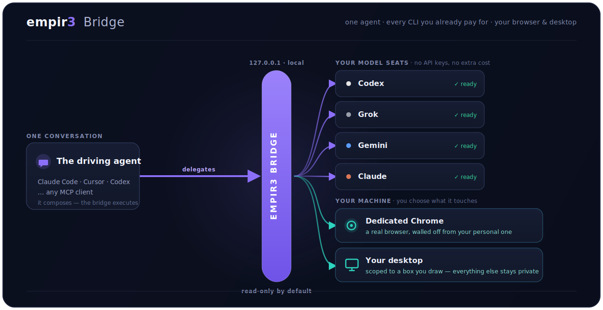
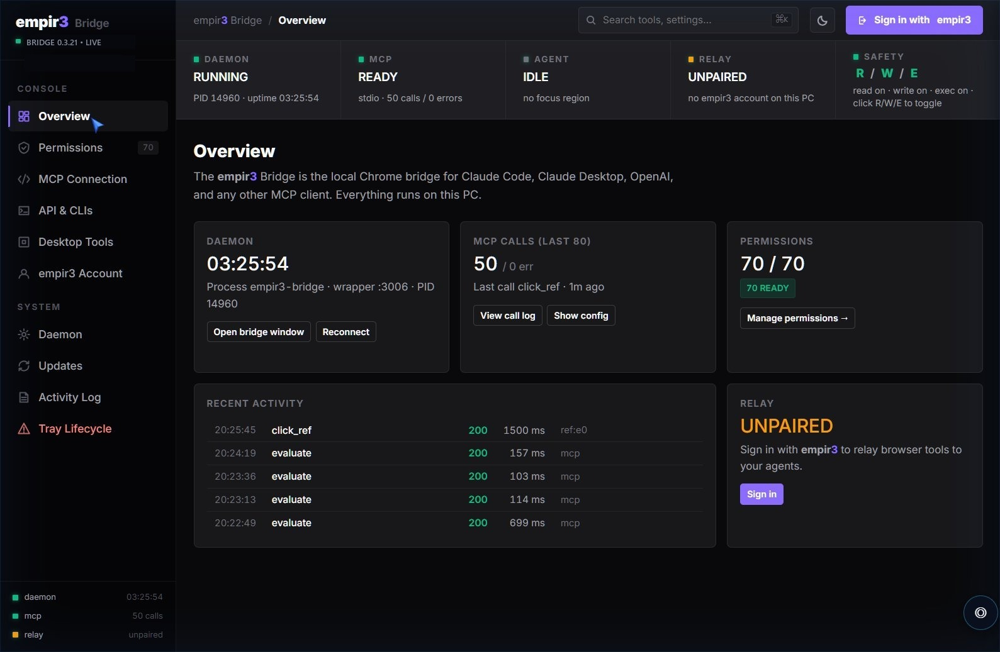
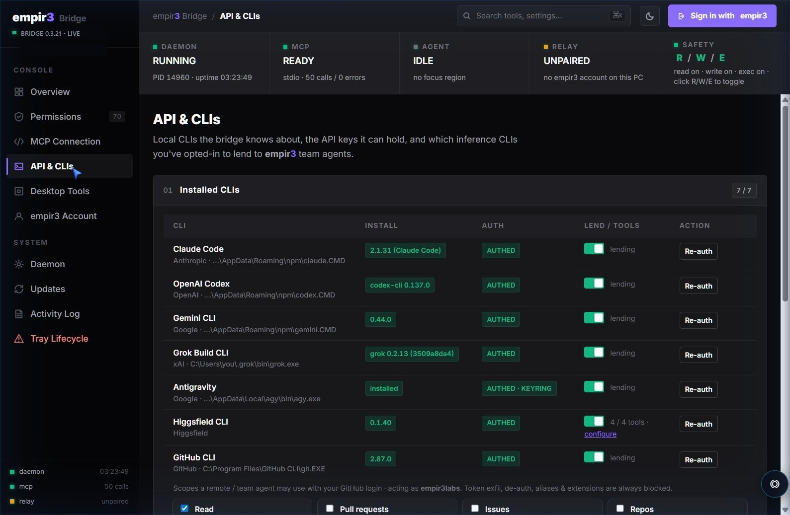
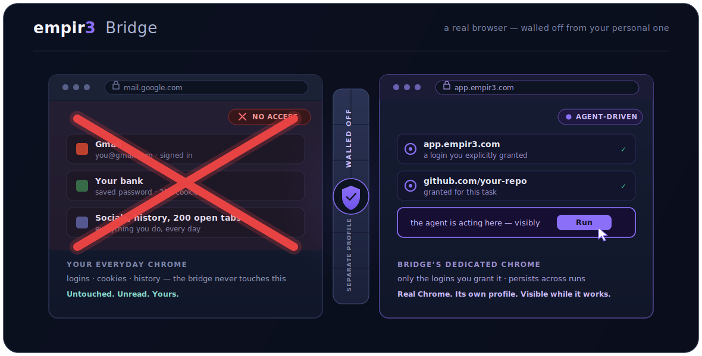
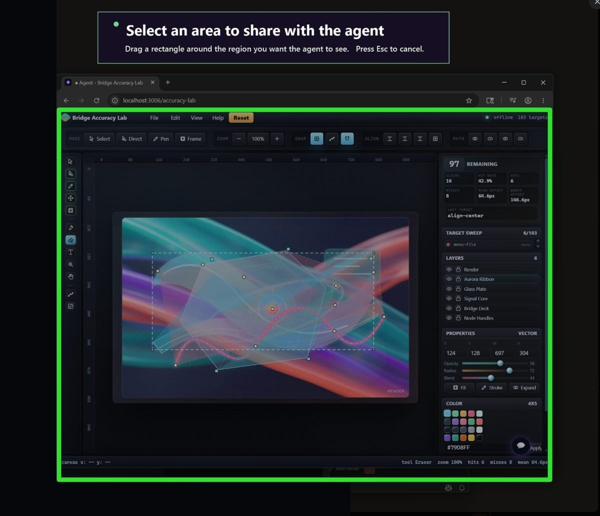
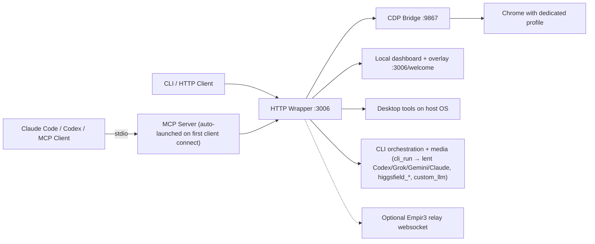

# Empir3 Bridge

### Your AI subscriptions, finally working as a team.

Codex, Grok, Gemini, and Claude — the seats you're **already paying for** — wired into a single conversation where one agent quarterbacks the rest. Have Codex build it, Grok draft it, Gemini check it, Claude tie it all together, and pull every answer back into one thread.

**No API keys handed out. No per-token meter running.** Just the flat-rate CLIs you're already signed into — suddenly collaborating instead of sitting in four lonely terminals talking to nobody.

Then the team acts where chat can't: a real browser and your live desktop, driven by **pixel-accurate, OS-level clicks** that map page coordinates to physical screen pixels — landing on the canvas, trusted-event, and React-Native-Web UIs that synthetic automation can't touch.

**Three ways to drive it — MCP, CLI, or WebSocket.** MCP for the agents you talk to, CLI for your terminal and scripts, or WebSocket via [empir3.com](https://empir3.com) for paired remote control. Same engine behind all three — pick the door that fits.


<sub>One prompt, the whole team — Codex on your OpenAI seat, Gemini on your Google seat, the browser on this machine, all in one thread. ([how it's wired ↓](#architecture))</sub>



Empir3 Bridge turns any MCP client (Claude Code, Codex, Cursor, …) into an agent that can:

1. **Run a whole AI team from one chat.** Orchestrate the other CLIs you're already signed into — Codex, Grok, Gemini, Claude — from a single conversation, with **no API keys handed out and no extra cost**. Have Codex build, Grok draft, Gemini review, and pull the answers back into the thread you're already in. The bridge runs each CLI under your own subscription and quietly handles its invocation quirks.
2. **Drive a real Chrome — walled off from your personal one.** The bridge runs its own dedicated Chrome profile that holds only the logins and history *you* give it, never your everyday browsing. Interact with accessibility-tree refs *and* real OS-level clicks that map page coordinates to physical pixels (so trusted-event-gated, canvas, and React-Native-Web UIs that ignore synthetic clicks still work).
3. **Operate your desktop** — DPI-aware mouse and screenshots across multiple monitors, with per-display click calibration.
4. **Generate images and video** — 40+ models through the Higgsfield CLI, discovered at runtime.

It runs entirely on your machine, keeps its own Chrome profile, binds its control servers to `127.0.0.1`, and **starts with every write-capable control off by default**. A visible overlay and ghost cursor show you exactly what the agent is targeting, and one toggle revokes control.


It's the same bridge pattern used inside [Empir3](https://empir3.com), open-sourced so developers can use it directly. Empir3 pairing is optional: local MCP use works without an account, and the remote relay only turns on after you explicitly pair this PC.

It all runs from one local console — what's connected, which capabilities are enabled, and a live log of every action the agent takes:



### One prompt, the whole team moving

> *"Have Codex scaffold the API, Gemini review the diff, then open the dashboard in a real browser and screenshot it for me."*

Codex writes under your OpenAI seat. Gemini reviews under your Google seat. The bridge drives its own Chrome to grab the shot — all from the single agent you started talking to. No keys copied, no tokens metered, no tab-switching, no four-terminals juggling act. That's the bridge.

## Why It's Different

Plenty of tools let an agent click around a browser. Almost none let your agents work *together*. That's the whole point of the bridge:

- **A team of models, not a lonely one.** This is the headline. `cli_run` lets the agent you're talking to delegate out to Codex / Grok / Gemini / Claude — each playing to its strengths, all on the subscriptions you already pay for. No API keys, no per-token billing, no glue code. `cli_status` tells the agent which models are ready *before* it tries, so a task always routes to a model that will actually run. One conversation, four minds.
- **A real browser, walled off from yours.** The bridge runs its own dedicated Chrome profile — separate from your personal browser — that only ever stores the passwords, cookies, and history *you* choose to give it. Your everyday browsing stays private and untouched. It's real Chrome (not a headless renderer), so sites work exactly as they should and the logins you grant it persist across runs.
- **Chat with the agent on the page itself — point, don't describe.** A chat panel drops right onto whatever page the bridge is driving. Instead of typing *"the blue button near the top-right,"* you **point at it**: pin a numbered note to any element, draw on the layout, or snap a screenshot — and it all goes to the agent as context. Talk to Claude standalone, or your whole Empir3 team if paired. The agent acts on the same page in front of you, so you watch the change land instead of alt-tabbing to a terminal.
- **You choose what it sees on your desktop.** Desktop control is the scary part of any agent — so the bridge inverts it. Instead of handing over your whole screen, **drag a box around just the app or area you want help with.** Screenshots and snapshots auto-scope to that box, marked by a visible on-screen frame; everything outside it stays private. It **stays as long as you're using it** — the 30-minute timer is idle-only and resets on every action, so active work never loses scope — you can keep it open indefinitely for a long watch, and **close it anytime by clicking the ✕ on the box itself.**
- **Trusted, OS-level clicks.** `desktop_click_page` maps a page element to a physical screen pixel (content-window origin + DPR + per-display calibration) and fires a real hardware click — the thing synthetic CDP clicks can't do on trusted-event-gated UIs.
- **Visible and governed by default.** Read-only out of the box; a click-through overlay + ghost cursor show what's being targeted; action receipts, per-capability lend toggles, and one-click revoke keep the human in control.

Plus the table stakes: accessibility-ref interaction, multi-monitor desktop control, a safe `/desktop-test` harness, and a tray app with signed payload updates and version status.

### Orchestrate the CLIs you already pay for

Every AI CLI you're signed into, discovered and authed by the bridge — flip one toggle to lend it to the agent. No API keys, no per-token billing.



### A real browser, walled off from yours

The bridge drives its own dedicated Chrome profile — your everyday browser, logins, and history stay private and untouched.



### Chat with the agent right on the page

Press one shortcut (`Ctrl+Shift+C`) and a chat panel drops onto whatever page the bridge is driving. Talk to Claude there — and instead of *describing* what you mean, **point at it**:

- **📌 Annotate** — click any element to pin a numbered note to it. Your comment, the element, and its exact selector go to the agent as structured context.
- **✎ Draw** — scribble on the layout to circle, cross out, or sketch the change you want.
- **📷 Snap** — capture the current view and send it along.

The agent acts on the **same page you're looking at** — clicking, typing, navigating, even **generating a fresh image and dropping it straight in** — while a visible overlay and ghost cursor show exactly what it's targeting. No alt-tabbing to a terminal, no describing in words what you could just point at. Standalone, it's you and Claude; paired with Empir3, the panel talks to your whole team.


### You choose what it sees on your desktop

Drag a box around just the app you want help with. Screenshots and snapshots auto-scope to that box; everything outside it stays private. Close it anytime by clicking the ✕ on the box.



## Install

**Point your agent at this repo and tell it to install.** Claude Code, Codex, Cursor — any agent with a terminal — will clone it, install dependencies, and start the bridge from source in about a minute. Or do it yourself with the [60-second Quickstart](#60-second-developer-quickstart) below. It runs entirely on your machine — no account required.

> **A packaged Windows installer is coming.** A one-click `Empir3Setup.exe` — a tiny bootstrapper that fetches an Ed25519-signed payload, installs the tray app, and starts on login — is built by the release pipeline but **isn't recommended for general use yet** while we finish Authenticode code-signing (Azure Trusted Signing, pending domain approval). Until it's signed, unsigned builds can trip Windows SmartScreen and antivirus false-positives, so for now install from source (above). This note goes away once signing is live.

Windows-first. The bridge core, browser tools, and CLI work on macOS and Linux, but the full desktop tool surface (UIA snapshot, pointer overlay, calibration, native screenshot grids) is Windows-only today.

## 60-Second Developer Quickstart

Clone it, install, and run — about sixty seconds:

```bash
git clone https://github.com/empir3hq/empir3-bridge
cd empir3-bridge
npm install
npm start
```

Or install the published package from npm:

```bash
npm install -g @empir3/empir3-bridge
empir3-bridge            # starts the bridge + Chrome  (empir3-bridge --status / --kill to manage)
```

Open the dashboard:

```text
http://localhost:3006
```

Then add the bridge to a Claude Code project with `.mcp.json`. Using the published package (no clone needed):

```json
{
  "mcpServers": {
    "empir3-bridge": {
      "type": "stdio",
      "command": "npx",
      "args": ["-y", "-p", "@empir3/empir3-bridge", "empir3-bridge-mcp"]
    }
  }
}
```

Or point it at a local clone (for development):

```json
{
  "mcpServers": {
    "empir3-bridge": {
      "type": "stdio",
      "command": "npx",
      "args": ["tsx", "<path-to-bridge>/src/mcp-server.ts"]
    }
  }
}
```

Try a browser task:

```text
Use the browser bridge to open example.com and take a screenshot.
```

Or put the headline to work — one agent driving another, using a CLI you already pay for:

```text
Use cli_status to see which CLIs are ready, then use cli_run to have Gemini summarize this README.
```

## What You Get

### Orchestrate Other AI CLIs (4 tools)

The headline capability: drive the coding CLIs you're already logged into, from the agent you're already talking to. Toggle each CLI on in the welcome console (**API & CLIs** pane); the bridge runs it under your own subscription — no API keys leave your machine.

- `cli_status` — which lent CLIs are ready *right now* (installed + lent + authenticated), one row per model with the blocker if not ready. Call this first to route a task to a model that will actually run.
- `cli_run` — run a lent CLI (`codex` / `grok` / `gemini` / `claude`) with a prompt and get its text back. `mode:"text"` returns the answer read-only; `mode:"agentic"` lets it write files in a working dir. Pass `background:true` for long runs.
- `cli_runs`, `cli_run_status` — list invocations and poll a background run to completion, each with a saved transcript path.

Example prompt: *"Use cli_run to have Codex scaffold the endpoint, then have Gemini review the diff."* One agent, multiple models, your seats — no keys handed out.

### Browser Control (15 tools)

- `browser_status`, `browser_navigate`, `browser_refresh`
- `browser_screenshot`, `browser_snapshot`, `browser_text`
- `browser_click`, `browser_click_ref`, `browser_click_xy`
- `browser_type`, `browser_type_ref`, `browser_press`, `browser_scroll`
- `browser_highlight`, `browser_evaluate`

### Desktop Control (29 tools)

Mouse and screenshot primitives:

- `desktop_monitors`, `desktop_cursor_position`
- `desktop_screenshot` — supports `region:{x,y,width,height}` for native-res crops and `grid:true` to overlay a coordinate grid on the saved image (useful for vision-coord targeting on CEF/Electron apps where UIA is blind)
- `desktop_screenshot_zoom` — zoomed-in slice of the desktop for fine pointing
- `desktop_click`, `desktop_hover`, `desktop_drag`

UI Automation snapshots (Windows):

- `desktop_snapshot` — enumerate visible interactive elements via UIA; returns refs `d0..dN`
- `desktop_snapshot_som` — set-of-marks overlay variant for vision models
- `desktop_click_ref`, `desktop_hover_ref` — operate on snapshot refs instead of pixel coords
- `desktop_overlay` — toggle click-through labeled-box overlay over the snapshot

Agent-focus region (gesture "help me here" instead of granting whole-desktop control):

- `desktop_select_region` — user drags a rectangle; subsequent screenshot/snapshot calls auto-scope to it (30-min TTL). A click-through chip anchored to the region tells the user focus is active.
- `desktop_release_focus`, `desktop_focus_status`
- `desktop_focus_grid` — overlay a labeled coordinate grid on the focused region
- `desktop_click_cell`, `desktop_pointer_cell` — click or move to a named grid cell (e.g. `B3`)

On-screen pointer hint (a visible cursor agents can show before clicking):

- `desktop_pointer_show`, `desktop_pointer_move`, `desktop_pointer_pulse`, `desktop_pointer_hide`, `desktop_pointer_status`

Pointer calibration (correct for per-display offset between OS cursor and rendered visuals):

- `desktop_calibrate_pointer`, `desktop_calibration_status`, `desktop_pick_point`

Browser-page → physical-screen clicks (drive the bridge's own Chrome page with real OS-level input):

- `page_to_screen` — inspect-only: resolve a page element (CSS selector, snapshot ref, or `cssX,cssY`) to its physical virtual-screen pixel, the calibrated click coordinate, the content-window origin, and devicePixelRatio. Use it to verify where a click will land before firing one.
- `desktop_click_page` — a real OS-level mouse click on an element in the bridge's own Chrome page, mapped page→screen (content-window origin + DPR + per-display calibration). Use it for trusted-event-gated, drag-handle, and native-feel widgets that ignore synthetic clicks.
- `desktop_pointer_page` — show the click-through ghost cursor on a page element (visual-only, no click).

Desktop tools use DPI-aware physical virtual-screen coordinates. Multi-monitor layouts with negative coordinates are supported.

### In-Page Chat, Annotation & Recording (6 tools)

The bridge injects a chat panel into every page its Chrome loads — see [Chat with the agent right on the page](#chat-with-the-agent-right-on-the-page). The agent reads and writes that panel through these tools, and annotations (pinned element notes), drawings, and screenshots the user makes there arrive as context on the next message.

- `browser_chat`, `browser_read_chat` — post to and read the in-page panel.
- `browser_record_start`, `browser_record_stop`, `browser_play`, `browser_recordings` — record a flow of clicks/types/scrolls and replay it later.

### Reliability And Safety (6 tools)

- `bridge_tool_advisor` — agent asks "what tool should I use for X?", bridge answers with the right one and shows current safety state
- `bridge_reliability_status`, `bridge_reliability_smoke`, `bridge_action_log`
- `bridge_safety_status`, `bridge_revoke_control`

These are there so an agent can diagnose the bridge before taking action, and so the user can see or revoke write-capable controls.

### Generative Media & Custom Models (5 tools)

The bridge is also a thin gateway to image/video generation and any custom model you have logged in locally. Configure them once in the welcome console (`http://localhost:3006/welcome`, **API & CLIs** pane):

- `higgsfield_models` — list the available Higgsfield models (40+, typed `image` / `video` / `text`) so the agent picks a valid id at runtime instead of guessing from a hard-coded list.
- `higgsfield_status`, `higgsfield_list`, `higgsfield_generate` — generate via the Higgsfield CLI; `higgsfield_generate` is self-documenting (an unknown model id returns the live catalog). Output lands in `~/.empir3-bridge/artifacts/higgsfield/`.
- `custom_llm` — generic dispatcher for any OpenAI-compatible model you've configured (Ollama, LM Studio, OpenRouter, vLLM, your own server). Routes by `provider` slug; registered only once at least one custom provider exists.

The **API & CLIs** pane is also where you flip the **lend toggles** that power the [CLI orchestration tools](#orchestrate-other-ai-clis-4-tools) above — Codex, Grok, Gemini, Claude, and Higgsfield. Each row shows install status, auth status, and a one-click auth-launch that opens the CLI in a console with the project cwd. See [docs/AGENT_GUIDE.md](docs/AGENT_GUIDE.md) for the full integration model.

## Control And Trust Model

Empir3 Bridge is powerful software. Treat it like a local automation driver, not a passive browser extension.

- Local MCP mode is the default. The bridge listens on `127.0.0.1`, launches a dedicated Chrome profile, and exposes tools only to local clients configured to talk to it.
- Paired Empir3 mode is opt-in. Pairing stores a bridge token locally and opens a websocket relay to Empir3 so approved remote agents can send commands to this PC.
- Local permissions are still enforced. Read, write, execute, desktop, eval, recording, handler-family, and CLI-lending controls live on the device and can be toggled from the welcome console.
- Browser-origin requests are hardened with a per-launch nonce. Cross-origin browser writes and overlay websocket connections must present the bridge nonce instead of relying on open localhost access.
- The tray is part of the safety surface. It shows the running version, relay/account state, update status, logs, and quick actions for reconnect, sign-out, uninstall, and clean quit.
- Sensitive outputs stay local by default: screenshots, recordings, logs, transcripts, generated artifacts, provider keys, and bridge auth live in local data paths listed below.

## Safety Model

Empir3 Bridge is a control surface, so the default posture is conservative.

- Read tools are on by default.
- Navigation tools are on by default.
- Page interaction tools are off by default.
- Desktop mouse tools are off by default.
- JavaScript eval is off by default.
- Recording and replay tools are off by default.
- Empir3 relay is off until this PC is paired.

Open the welcome console:

```text
http://localhost:3006/welcome
```

Check current control state:

```bash
npx tsx src/cli.ts safety-status
```

## Release Builds

Windows release artifacts are built from this repository:

```bash
npm run build:windows
```

That writes artifacts under `build/dist/`:

- `Empir3Setup.exe`
- `bridge-payload-vX.Y.Z.tar.gz`
- `bridge-payload-vX.Y.Z.sig`
- `bridge-version.json`
- `empir3-bridge.crx`
- `empir3-bridge-update.xml`

The payload version comes from `package.json`. Keep the tray label, manifest, download metadata, and release notes tied to that version. See `docs/RELEASE.md`.

Disable all write-capable tools immediately:

```bash
npx tsx src/cli.ts revoke-control
```

The dashboard also shows a visible `Control Safety` card and has a `Revoke Write Control` button.

Read the full safety notes in [docs/SAFETY.md](docs/SAFETY.md).

## Test The Bridge Safely

The bridge ships with a local test harness for click, hover, and drag accuracy:

```text
http://localhost:3006/desktop-test
```

Or open it from the CLI:

```bash
npx tsx src/cli.ts desktop-test
```

This page gives agents safe targets for desktop hover, click, and drag tests without moving your real windows around. See [docs/TESTING.md](docs/TESTING.md).

## Use Standalone From CLI

```bash
npx tsx src/cli.ts status
npx tsx src/cli.ts navigate "https://example.com"
npx tsx src/cli.ts snapshot
npx tsx src/cli.ts click-ref "e5"
npx tsx src/cli.ts click-xy 500 320
npx tsx src/cli.ts type-ref "e3" "hello"
npx tsx src/cli.ts screenshot
npx tsx src/cli.ts text
npx tsx src/cli.ts desktop-monitors
npx tsx src/cli.ts desktop-screenshot all
npx tsx src/cli.ts reliability-smoke
```

Run with no args for the full command list.

## Architecture



The MCP server is a thin stdio shim. On the first connection from a Claude Code / Codex / Cursor client it boots the HTTP wrapper and the CDP bridge if they aren't already running, so you don't have to babysit two processes — installing the `.mcp.json` block is enough.

Core files:

- `src/launch.js`: starts and stops the bridge process group.
- `src/bridge.ts`: talks to Chrome through CDP.
- `src/server.ts`: HTTP/WebSocket wrapper, dashboard, settings, safety, desktop tools.
- `src/mcp-server.ts`: MCP tool server.
- `src/cli.ts`: scriptable local CLI.

## Local-Only Network Defaults

The bridge binds its wrapper and CDP HTTP server to `127.0.0.1` by default. Chrome remote debugging is also launched with `--remote-debugging-address=127.0.0.1`.

This means the bridge is intended for local agents on your machine, not LAN or internet access. Paired Empir3 mode uses an outbound websocket to Empir3; it does not expose the local bridge as a public server.

The bridge also stamps a per-launch nonce into its controlled welcome/overlay surfaces. Browser-origin write requests and overlay websocket connections from non-local origins must present that nonce.

## Data Locations

- Chrome profile: `~/.empir3-bridge/profile/`
- Chat config (mode, API key, per-tool toggles): `~/.empir3-bridge/config.json`
- Bridge auth token after Empir3 pairing: `%APPDATA%\Empir3\bridge-auth.json` on Windows, `~/.empir3/Empir3/bridge-auth.json` on macOS/Linux
- Bridge settings (permissions, device name, home directory, handlers, custom providers): `%APPDATA%\Empir3\bridge-settings.json` on Windows, `~/.empir3/Empir3/bridge-settings.json` on macOS/Linux
- Current per-launch bridge nonce: `~/.empir3-bridge/nonce`
- Conversation transcripts: `~/.empir3-bridge/conversations/`
- Lent-CLI run transcripts (`cli_run`): `~/.empir3-bridge/cli-runs/`
- Generated artifacts (e.g. Higgsfield images): `~/.empir3-bridge/artifacts/`
- Screenshots and action feedback: `./feedback/`
- Recordings: `./recordings/`

`feedback/` and `recordings/` are gitignored.

## Troubleshooting

### Higgsfield CLI install fails on Windows with a tar error

The Higgsfield npm package ships a postinstall tarball with colons in some file paths. The bundled BusyBox/Git-Bash `tar` on Windows refuses those names and the install aborts.

Workaround:

```bash
npm install -g higgsfield-cli --ignore-scripts
cd "%APPDATA%\npm\node_modules\higgsfield-cli"
"C:\Windows\System32\tar.exe" -xzf path\to\postinstall-bundle.tgz
```

The Windows-system `tar.exe` (Microsoft's libarchive build) handles the colon paths. After that the CLI is on `PATH` and the welcome console's **API & CLIs** pane will pick it up. The bridge probe (`higgsfield_status`) reports an actionable error if any of these steps were skipped.

### MCP client says "Connected" but no `browser_*` / `desktop_*` tools appear

Three known causes:

- `node_modules/` missing in the bridge repo — run `npm install`.
- `zod` resolved to v4 (the MCP SDK silently fails tool registration). The repo pins `zod ^3.25` — make sure your lockfile didn't override it.
- The path in your `.mcp.json` contains a space. `npx tsx` ESM loader splits at the first space and crashes without a useful error.

### Chrome won't launch the dedicated profile

Kill any existing instance with `npm run kill`, then `npm start -- --fresh`. The profile lives at `~/.empir3-bridge/profile/` — deleting it is non-destructive (just re-logs you out of bridge tabs).

## Fresh Runs And Parallel Bridges

Fresh launch:

```bash
npm start -- --fresh
```

Stop the bridge:

```bash
npm run kill
```

Status:

```bash
npm run status
```

Parallel bridge example:

```bash
EMPIR3_PW_PORT=3106 \
EMPIR3_BRIDGE_HTTP_PORT=9967 \
EMPIR3_CDP_PORT=9322 \
EMPIR3_BRIDGE_PROFILE=$HOME/.empir3-bridge/profile-test \
EMPIR3_BRIDGE_LABEL=TEST \
npm start
```

Drive it:

```bash
BRIDGE_URL=http://localhost:3106 npx tsx src/cli.ts status
```

## Use With Empir3

The bridge is useful by itself. Empir3 is what happens when you put a team around it.

With Empir3, Vincent coordinates specialist agents that can work through the same bridge: research, browser work, app checks, design review, and implementation loops. The bridge is the local control plane. Empir3 is the collaborative AI team.

Pairing is optional and will stay opt-in. No Empir3 account is required to use this repo. If you pair, the bridge stores a local token, reports this device to Empir3, and opens an outbound relay websocket. Sign out from the tray or welcome console to remove the local pairing token and return to local-only use.

Try Empir3 at [empir3.com](https://empir3.com).

## Contributing

We welcome bug reports, smoke-test notes, and PRs. Start with:

- [CONTRIBUTING.md](CONTRIBUTING.md)
- [SECURITY.md](SECURITY.md)
- [docs/TESTING.md](docs/TESTING.md)

Useful local checks:

```bash
npx tsc --noEmit
npm run build:mcp
npm test
npm pack --dry-run
```

## Project Status

Pre-1.0. The bridge is used heavily in Empir3 development and is being shaped into a clean standalone OSS product. Expect rapid iteration around install, cross-platform polish, and safety UX.

## License

MIT. See [LICENSE](LICENSE).
