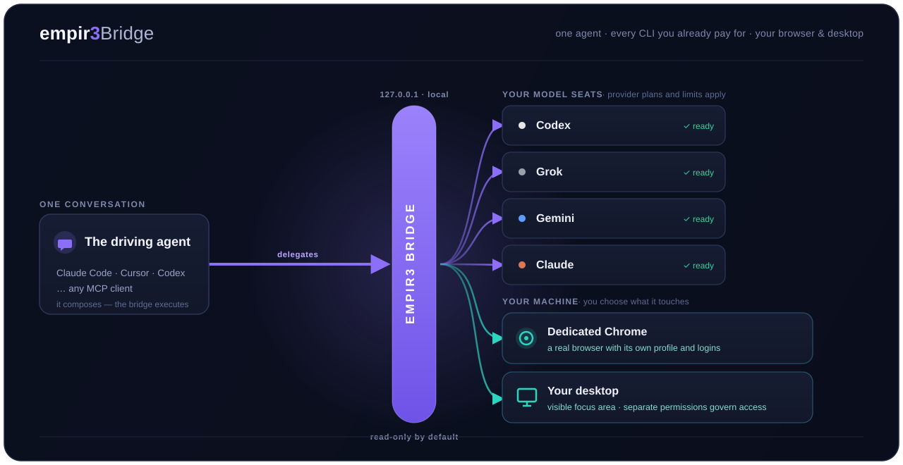
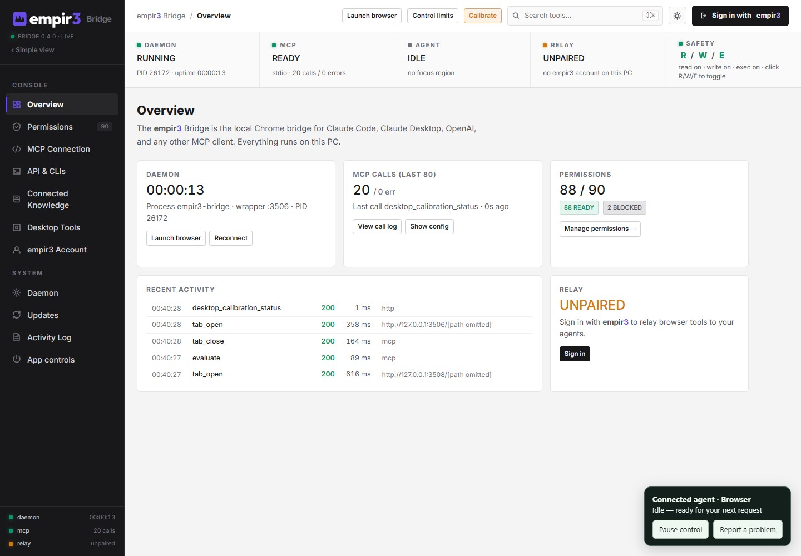
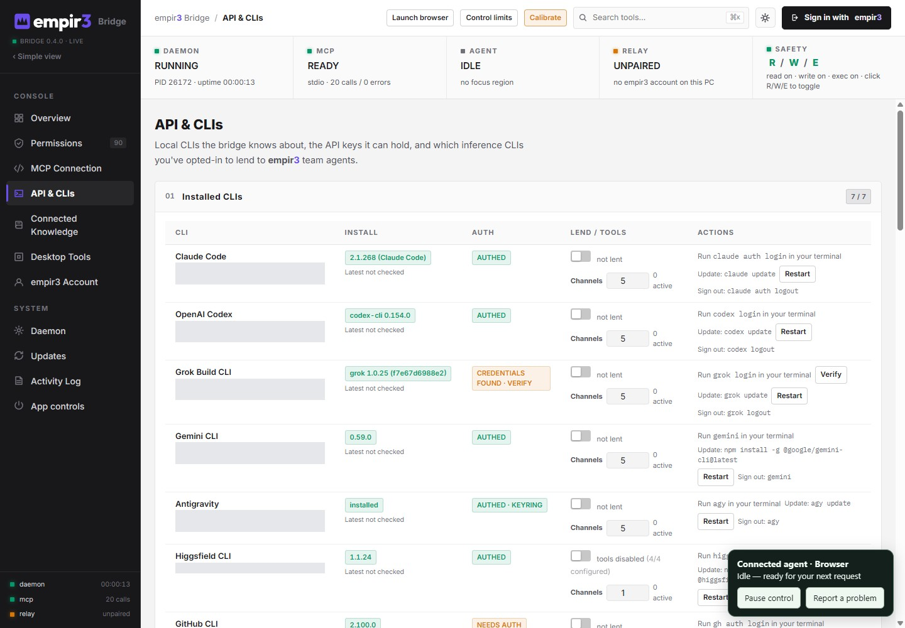
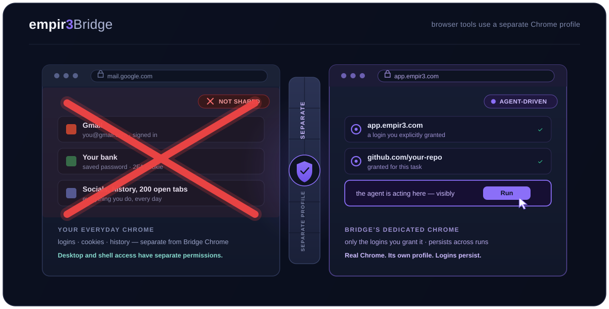
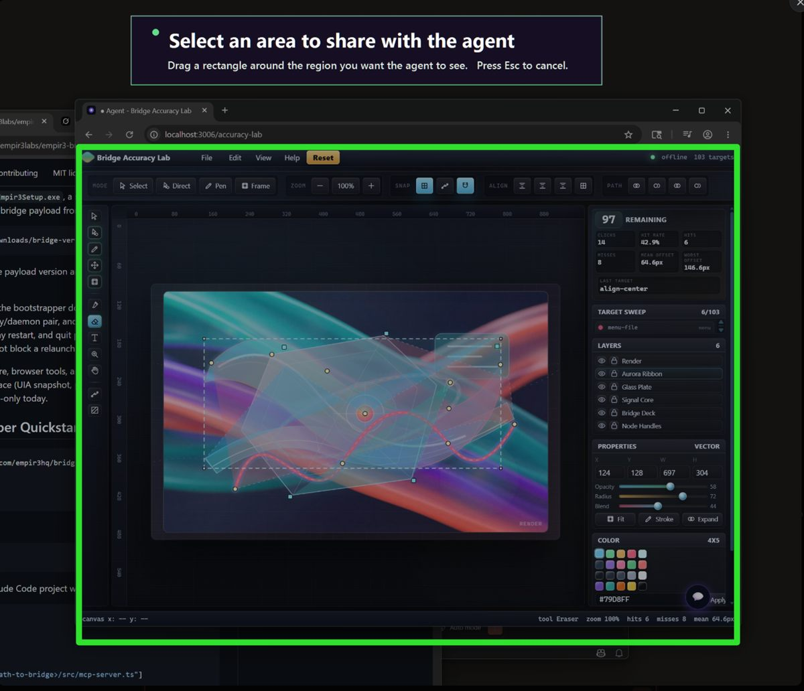
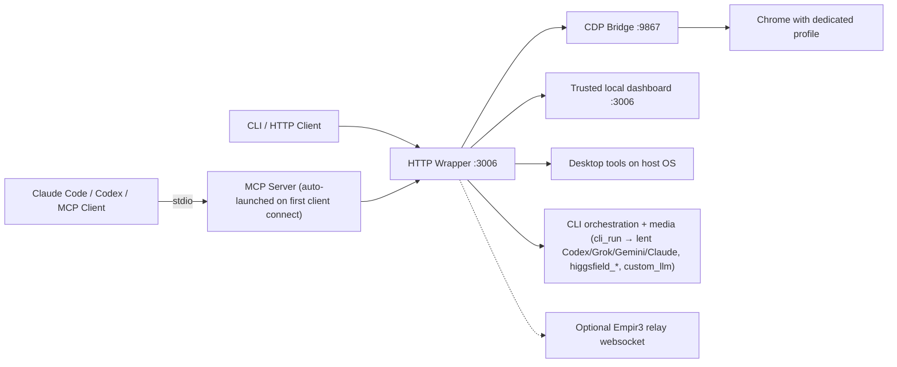

# Empir3 Bridge

### Your AI subscriptions, finally working as a team.

Connect an AI agent to a dedicated Chrome browser, local tools and, on Windows, desktop apps. Use the local console to choose which abilities to enable. You can use Bridge with a standalone MCP client or pair it with your Empir3 team.

Bridge can also call the AI CLIs you have installed and signed into, including Codex, Grok, Gemini and Claude. Each provider's subscription limits, supported authentication methods and charges still apply. Optional API providers and media tools can incur usage charges; Bridge does not make them free.

Browser actions use page observations and verified targets. Windows desktop tools add native window controls, screenshots and mouse/keyboard input. Read back the result after an action: sending input alone does not prove that the app accepted it.

**Three ways to drive it — MCP, CLI, or WebSocket.** MCP for the agents you talk to, CLI for your terminal and scripts, or WebSocket via [empir3.com](https://empir3.com) for paired remote control. Same engine behind all three — pick the door that fits.



<sub>One prompt, the whole team — Codex on your OpenAI seat, Gemini on your Google seat, the browser on this machine, all in one thread. ([how it's wired ↓](#architecture))</sub>



Empir3 Bridge turns any MCP client (Claude Code, Codex, Cursor, …) into an agent that can:

1. **Run several AI tools from one chat.** Ask an agent to delegate to installed, authenticated CLIs and collect their results. Check `cli_status` first for each CLI's actual availability and authentication state.
2. **Drive Chrome with a separate profile.** Browser tools use Bridge's dedicated Chrome profile. Its cookies, logins and history are separate from your everyday Chrome profile. Observe the page, select an exact tab and verify each action's result.
3. **Operate your desktop** — DPI-aware mouse and screenshots across multiple monitors, with per-display click calibration.
4. **Generate images and video** — 40+ models through the Higgsfield CLI, discovered at runtime.
5. **Build one agent from several computers.** A desktop can lend the Brain, a laptop can lend Whisper as Ears, and a GPU box can lend Kokoro as Mouth plus ComfyUI as Imagination. Empir3 routes each ask to the selected machine automatically; private endpoint addresses and keys stay on that Bridge.

The Bridge runs on your machine and binds its control servers to `127.0.0.1`. Cloud models, websites and paired Empir3 requests still use the network. Write-capable controls start disabled. Enable only the abilities you need; **Release control** stops active input, and Permissions lets you disable capabilities.


It's the same bridge pattern used inside [Empir3](https://empir3.com), open-sourced so developers can use it directly. Empir3 pairing is optional: local MCP use works without an account, and the remote relay only turns on after you explicitly pair this PC.

It all runs from one local console — what's connected, which capabilities are enabled, and a live log of every action the agent takes:



### One prompt, the whole team moving

> *"Have Codex scaffold the API, Gemini review the diff, then open the dashboard in a real browser and screenshot it for me."*

With those CLIs configured, the agent can ask Codex to write, Gemini to review and the Bridge browser to capture the result. Availability and quotas come from your providers; the Bridge returns a failure when a requested tool cannot run.

## Why It's Different

Plenty of tools let an agent click around a browser. Almost none let your agents work *together*. That's the whole point of the bridge:

- **CLI delegation.** `cli_status` reports installed tools and their current authentication state. `cli_run` invokes the selected CLI and returns its result. Provider limits or service changes can still prevent a run.
- **A dedicated browser.** Bridge's Chrome profile keeps task logins separate from your personal browser. Windows can show a visible browser; headless hosts can use browser tools without a display. Website compatibility still needs to be checked for the task.
- **Chat from a trusted local surface.** Browser chat and agent replies live on the Bridge's localhost dashboard, outside the JavaScript world of websites Chrome displays. A hostile page cannot submit a message as you or read the agent's replies. Use snapshots, element refs, screenshots, and the native ghost cursor to point at the page without lending that page the control channel.
- **A visible desktop focus area.** Drag a box around the area you want the agent to work on. Supported screenshots and observations default to that area. The focus box is a convenience, not an operating-system sandbox: explicit captures and other enabled tools can have broader access. The default focus expires after 30 minutes without use; close or release it when finished.
- **Native Windows input.** Desktop tools map observed controls to screen coordinates and send mouse or keyboard input. Foreground-window and target guards refuse input when the selected target changes. Verify the resulting page or field before continuing.
- **Visible and governed by default.** Read-only out of the box; a click-through overlay + ghost cursor show what's being targeted; action receipts, per-capability lend toggles, and one-click revoke keep the human in control.

Plus the table stakes: accessibility-ref interaction, multi-monitor desktop control, a safe `/desktop-test` harness, and a tray app with signed payload updates and version status.

### Orchestrate the CLIs you already pay for

Open **API & CLIs** to inspect supported CLI installations and sign-in status. Enable sharing for each tool you want your Empir3 agents to use. CLI availability, provider plans and usage limits vary.



<sub>Installation paths are masked in this screenshot for privacy. Status and sharing controls are shown as captured.</sub>

### One agent, several of your computers

Install and pair the Bridge on each machine, give every device a recognizable
name, then add the ability that computer is willing to lend. A provider can be
a chat model, speech-to-text service, text-to-speech service, or image engine.
The Bridge includes native wires for Whisper, Kokoro, AUTOMATIC1111, ComfyUI,
and OpenAI-compatible speech/image APIs.

In Agent Builder, choose a machine for Brain, Ears, Mouth, and Imagination—or
choose **Any of my machines** when the same provider/model is offered by more
than one device. An exact pin never drifts: if that computer goes offline, the
request names the unavailable device and stops without substituting another
machine or a cloud service. Large images and videos move through a bounded,
single-use upload grant instead of being forced into a WebSocket frame.

### A browser with its own profile

Browser tools drive Bridge's dedicated Chrome profile and do not attach to your everyday Chrome profile. This separation does not restrict other capabilities you enable, such as desktop input, file access or shell commands. Review those permissions separately.



### Chat with the agent from the trusted dashboard

Open `http://localhost:3006/` or use **Chat** in the desktop toolbar. The chat
surface is served by the local Bridge and cannot be inspected or driven by the
website in the controlled Chrome tab. Standalone mode talks to the connected
local MCP client; paired mode can talk to your Empir3 team.

Version 0.3.72 retired the former page-injected chat panel. Injecting a
credentialed control panel into arbitrary website JavaScript created the wrong
trust boundary: a hostile page could imitate the user. Page context now comes
from explicit snapshots, element refs, screenshots, and scoped desktop tools.

### You choose what it sees on your desktop

Drag a box around the app you want help with. Supported screenshots and snapshots default to that area. Close the box or use **Release control** when finished. Use Permissions to control broader desktop, file and shell access; the box does not replace those settings.



## Install

**Point your agent at this repo and tell it to install.** Claude Code, Codex, Cursor — any agent with a terminal — will clone it, install dependencies, and start the bridge from source in about a minute. Or do it yourself with the [60-second Quickstart](#60-second-developer-quickstart) below. It runs entirely on your machine — no account required.

> **Signed packages are distributed from [empir3.com/download](https://empir3.com/download) for Windows, macOS, and desktop Linux, plus a lightweight Linux server/VPS package.** Windows packages use Authenticode signing, macOS packages use Developer ID signing, Apple notarization, and stapling, and Linux packages are authenticated by the signed release manifest. Installed packages update through the same signed release channel.

Provider APIs, local LLM endpoints, CLI subscriptions, pairing, and MCP are cross-platform. The full native desktop-automation surface (UIA snapshot, pointer overlay, calibration, and native screenshot grids) remains Windows-only; unsupported capabilities fail explicitly on macOS and Linux.

## 60-Second Developer Quickstart

Clone it, install, and run — about sixty seconds:

```bash
git clone https://github.com/empir3hq/empir3-bridge
cd empir3-bridge
npm install
npm start
```

Or install the current public package from npm:

```bash
npm install -g @empir3hq/empir3-bridge
empir3-bridge            # starts the bridge + Chrome  (empir3-bridge --status / --kill to manage)
```

Open the dashboard:

```text
http://localhost:3006
```

Then add the bridge to a Claude Code project with `.mcp.json`. Using the
published package requires no local clone:

```json
{
  "mcpServers": {
    "empir3-bridge": {
      "type": "stdio",
      "command": "npx",
      "args": ["-y", "-p", "@empir3hq/empir3-bridge", "empir3-bridge-mcp"]
    }
  }
}
```

Or point it at a local clone:

```json
{
  "mcpServers": {
    "empir3-bridge": {
      "type": "stdio",
      "command": "npx",
      "args": ["tsx", "<path-to-bridge>/src/mcp-server.ts"]
    }
  }
}
```

Try a browser task:

```text
Use the browser bridge to open example.com and take a screenshot.
```

Or put the headline to work — one agent driving another, using a CLI you already pay for:

```text
Use cli_status to see which CLIs are ready, then use cli_run to have Gemini summarize this README.
```

## What You Get

### Orchestrate Other AI CLIs (4 tools)

Use the coding CLIs you're already signed into from your connected agent. Toggle sharing in **API & CLIs**; the CLI runs locally with its configured provider authentication. Your provider's plan and limits apply.

- `cli_status` — installed/shared/authentication state, with blockers where known. Call this first, then check the actual run result.
- `cli_run` — run a lent CLI (`codex` / `grok` / `gemini` / `claude`) with a prompt and get its text back. `mode:"text"` returns the answer read-only; `mode:"agentic"` lets it write files in a working dir. Pass `background:true` for long runs.
- `cli_runs`, `cli_run_status` — list invocations and poll a background run to completion, each with a saved transcript path.

Example prompt: *"Use cli_run to have Codex scaffold the endpoint, then have Gemini review the diff."* One agent, multiple models, your seats — no keys handed out.

### Browser Control

Start with the [operating guide](docs/AGENT_GUIDE.md): discover, select an exact target, observe, act and verify. Use `bridge_control_catalog`, `bridge_control_activate`, `bridge_control_observe` and `bridge_control_run` for this loop. Tool availability depends on the installed version, platform and permissions; use live discovery rather than a fixed count.

- `browser_tab_state`, `browser_tab_open`, `browser_tab_focus`, `browser_tab_close` — work with the exact tab you own.
- `browser_dialog` — inspect and respond to an alert, confirmation or prompt using its returned dialog ID.

- `browser_status`, `browser_navigate`, `browser_refresh`
- `browser_screenshot`, `browser_snapshot`, `browser_text`
- `browser_click`, `browser_click_ref`, `browser_click_xy`
- `browser_type`, `browser_type_ref`, `browser_press`, `browser_scroll`
- `browser_highlight`, `browser_evaluate`

### Desktop Control

- `desktop_app` — discover, launch and inspect supported applications.
- `desktop_window` — list windows and manage the exact observed window, including resize and off-screen recovery on Windows.

Mouse and screenshot primitives:

- `desktop_monitors`, `desktop_cursor_position`
- `desktop_screenshot` — supports `region:{x,y,width,height}` for native-res crops and `grid:true` to overlay a coordinate grid on the saved image (useful for vision-coord targeting on CEF/Electron apps where UIA is blind)
- `desktop_screenshot_zoom` — zoomed-in slice of the desktop for fine pointing
- `desktop_click`, `desktop_hover`, `desktop_drag`

UI Automation snapshots (Windows):

- `desktop_snapshot` — enumerate visible interactive elements via UIA; returns refs `d0..dN`
- `desktop_snapshot_som` — set-of-marks overlay variant for vision models
- `desktop_click_ref`, `desktop_hover_ref` — operate on snapshot refs instead of pixel coords
- `desktop_overlay` — toggle click-through labeled-box overlay over the snapshot

Agent-focus region (a visible default capture area; permissions still govern access):

- `desktop_select_region` — user drags a rectangle; subsequent screenshot/snapshot calls auto-scope to it (30-min TTL). A click-through chip anchored to the region tells the user focus is active.
- `desktop_release_focus`, `desktop_focus_status`
- `desktop_focus_grid` — overlay a labeled coordinate grid on the focused region
- `desktop_click_cell`, `desktop_pointer_cell` — click or move to a named grid cell (e.g. `B3`)

On-screen pointer hint (a visible cursor agents can show before clicking):

- `desktop_pointer_show`, `desktop_pointer_move`, `desktop_pointer_pulse`, `desktop_pointer_hide`, `desktop_pointer_status`

Pointer calibration (correct for per-display offset between OS cursor and rendered visuals):

- `desktop_calibrate_pointer`, `desktop_calibration_status`, `desktop_pick_point`

Browser-page → physical-screen clicks (drive the bridge's own Chrome page with real OS-level input):

- `page_to_screen` — inspect-only: resolve a page element (CSS selector, snapshot ref, or `cssX,cssY`) to its physical virtual-screen pixel, the calibrated click coordinate, the content-window origin, and devicePixelRatio. Use it to verify where a click will land before firing one.
- `desktop_click_page` — a real OS-level mouse click on an element in the bridge's own Chrome page, mapped page→screen (content-window origin + DPR + per-display calibration). Use it for trusted-event-gated, drag-handle, and native-feel widgets that ignore synthetic clicks.
- `desktop_pointer_page` — show the click-through ghost cursor on a page element (visual-only, no click).

Desktop tools use DPI-aware physical virtual-screen coordinates. Multi-monitor layouts with negative coordinates are supported.

### Trusted Chat & Recording (6 tools)

The Bridge keeps chat on its localhost dashboard rather than exposing messages
to arbitrary page scripts.

- `browser_chat`, `browser_read_chat` — post to and read trusted local chat.
- `browser_record_start`, `browser_record_stop`, `browser_play`, `browser_recordings` — record a flow of clicks/types/scrolls and replay it later.

### Reliability And Safety (6 tools)

- `bridge_tool_advisor` — agent asks "what tool should I use for X?", bridge answers with the right one and shows current safety state
- `bridge_reliability_status`, `bridge_reliability_smoke`, `bridge_action_log`
- `bridge_safety_status`, `bridge_revoke_control`

These are there so an agent can diagnose the bridge before taking action, and so the user can see or revoke write-capable controls.

### Generative Media & Custom Models (5 tools)

The bridge is also a thin gateway to image/video generation and any custom model you have logged in locally. Configure them once in the welcome console (`http://localhost:3006/welcome`, **API & CLIs** pane):

- `higgsfield_models` — list the available Higgsfield models (40+, typed `image` / `video` / `text`) so the agent picks a valid id at runtime instead of guessing from a hard-coded list.
- `higgsfield_status`, `higgsfield_list`, `higgsfield_generate` — generate via the Higgsfield CLI; `higgsfield_generate` is self-documenting (an unknown model id returns the live catalog). Output lands in `~/.empir3-bridge/artifacts/higgsfield/`.
- `custom_llm` — generic dispatcher for a supported cloud API key or any OpenAI-compatible endpoint you've configured (Ollama, LM Studio, vLLM, your own server). Routes by `provider` slug; registered once at least one API or custom provider exists.

The **API Providers** section matches Empir3's key-backed text providers:
Anthropic, DeepSeek, Google AI, Groq, Mistral AI, Moonshot AI, OpenAI,
OpenRouter, Perplexity, xAI, and z.ai. A key is tested before it is saved and
the provider's available chat models are discovered. Native Anthropic and
Gemini calls and OpenAI-compatible calls all execute locally through the Bridge.

When the Bridge is paired with Empir3, either a supported API provider or a
custom provider can appear in Agent Builder under **My Bridge**. Turn on
**Available to my Empir3 agents**, then choose one of its models for an agent.
Only the provider name, model list, and availability cross the relay. The API
address and key stay on this computer, and an offline Bridge route stops instead
of silently switching to a paid Empir3 model.

For field-by-field setup examples, private-network guidance, testing steps, and
common troubleshooting questions, see the [Empir3 Bridge User Guide](docs/USER_GUIDE.md).

The **API & CLIs** pane contains the sharing controls for the [CLI orchestration tools](#orchestrate-other-ai-clis-4-tools). Each row shows installation and authentication status, plus an action or manual command supported by that host. See [docs/AGENT_GUIDE.md](docs/AGENT_GUIDE.md) for the full integration model.

## Control And Trust Model

Empir3 Bridge is powerful software. Treat it like a local automation driver, not a passive browser extension.

- Local MCP mode is the default. The bridge listens on `127.0.0.1`, launches a dedicated Chrome profile, and exposes tools only to local clients configured to talk to it.
- Paired Empir3 mode is opt-in. Pairing stores a bridge token locally and opens a websocket relay to Empir3 so approved remote agents can send commands to this PC.
- Local permissions are still enforced. Read, write, execute, desktop, eval, recording, handler-family, and CLI-lending controls live on the device and can be toggled from the welcome console.
- Browser-origin writes are nonce-gated. Browser WebSockets fail closed by role: native CLI clients must have no browser `Origin`, trusted control clients must come from the exact localhost dashboard origin, and the retired overlay role is rejected.
- The tray is part of the safety surface. It shows the running version, relay/account state, update status, logs, and quick actions for reconnect, sign-out, uninstall, and clean quit.
- Sensitive outputs stay local by default: screenshots, recordings, logs, transcripts, generated artifacts, provider keys, and bridge auth live in local data paths listed below.

## Safety Model

Empir3 Bridge is a control surface, so the default posture is conservative.

- Read tools are on by default.
- Navigation tools are on by default.
- Page interaction tools are off by default.
- Desktop mouse tools are off by default.
- JavaScript eval is off by default.
- Recording and replay tools are off by default.
- Empir3 relay is off until this PC is paired.

Open the welcome console:

```text
http://localhost:3006/welcome
```

Check current control state:

```bash
npx tsx src/cli.ts safety-status
```

## Release Builds

Windows release artifacts are built from this repository:

```bash
npm run build:windows
```

That writes artifacts under `build/dist/`:

- `Empir3Setup.exe`
- `bridge-payload-vX.Y.Z.tar.gz`
- `bridge-payload-vX.Y.Z.sig`
- `bridge-version.json`
- `empir3-bridge.crx`
- `empir3-bridge-update.xml`

The payload version comes from `package.json`. Keep the tray label, manifest, download metadata, and release notes tied to that version. See `docs/RELEASE.md`.

Disable all write-capable tools immediately:

```bash
npx tsx src/cli.ts revoke-control
```

The dashboard also shows a visible `Control Safety` card and has a `Revoke Write Control` button.

Read the full safety notes in [docs/SAFETY.md](docs/SAFETY.md).

## Test The Bridge Safely

The bridge ships with a local test harness for click, hover, and drag accuracy:

```text
http://localhost:3006/desktop-test
```

Or open it from the CLI:

```bash
npx tsx src/cli.ts desktop-test
```

This page gives agents safe targets for desktop hover, click, and drag tests without moving your real windows around. See [docs/TESTING.md](docs/TESTING.md).

## Use Standalone From CLI

```bash
npx tsx src/cli.ts status
npx tsx src/cli.ts navigate "https://example.com"
npx tsx src/cli.ts snapshot
npx tsx src/cli.ts click-ref "e5"
npx tsx src/cli.ts click-xy 500 320
npx tsx src/cli.ts type-ref "e3" "hello"
npx tsx src/cli.ts screenshot
npx tsx src/cli.ts text
npx tsx src/cli.ts desktop-monitors
npx tsx src/cli.ts desktop-screenshot all
npx tsx src/cli.ts reliability-smoke
```

Run with no args for the full command list.

## Architecture


```mermaid
flowchart LR
  A["Claude Code / Codex / MCP Client"] -->|stdio| B["MCP Server (auto-launched on first client connect)"]
  C["CLI / HTTP Client"] --> D["HTTP Wrapper :3006"]
  B --> D
  D --> E["CDP Bridge :9867"]
  E --> F["Chrome with dedicated profile"]
  D --> G["Trusted local dashboard :3006"]
  D --> H["Desktop tools on host OS"]
  D --> I["CLI orchestration + media (cli_run → lent Codex/Grok/Gemini/Claude, higgsfield_*, custom_llm)"]
  D -.-> J["Optional Empir3 relay websocket"]
```

The MCP server is a thin stdio shim. On the first connection from a Claude Code / Codex / Cursor client it boots the HTTP wrapper and the CDP bridge if they aren't already running, so you don't have to babysit two processes — installing the `.mcp.json` block is enough.

Core files:

- `src/launch.js`: starts and stops the bridge process group.
- `src/bridge.ts`: talks to Chrome through CDP.
- `src/server.ts`: HTTP/WebSocket wrapper, dashboard, settings, safety, desktop tools.
- `src/mcp-server.ts`: MCP tool server.
- `src/cli.ts`: scriptable local CLI.

## Local-Only Network Defaults

The bridge binds its wrapper and CDP HTTP server to `127.0.0.1` by default. Chrome remote debugging is also launched with `--remote-debugging-address=127.0.0.1`.

This means the bridge is intended for local agents on your machine, not LAN or internet access. Paired Empir3 mode uses an outbound websocket to Empir3; it does not expose the local bridge as a public server.

The bridge uses a per-launch nonce for browser-origin HTTP mutations. WebSocket roles are stricter: browser pages cannot claim the native CLI role, only the exact localhost dashboard origin can claim the control role, and no in-page overlay role exists.

## Data Locations

- Chrome profile: `~/.empir3-bridge/profile/`
- Chat config (mode, API-provider keys/sharing, per-tool toggles): `~/.empir3-bridge/config.json`
- Bridge auth token after Empir3 pairing: `%APPDATA%\Empir3\bridge-auth.json` on Windows, `~/.empir3/Empir3/bridge-auth.json` on macOS/Linux
- Bridge settings (permissions, device name, home directory, handlers, custom providers): `%APPDATA%\Empir3\bridge-settings.json` on Windows, `~/.empir3/Empir3/bridge-settings.json` on macOS/Linux
- Current per-launch bridge nonce: `~/.empir3-bridge/nonce`
- Conversation transcripts: `~/.empir3-bridge/conversations/`
- Lent-CLI run transcripts (`cli_run`): `~/.empir3-bridge/cli-runs/`
- Generated artifacts (e.g. Higgsfield images): `~/.empir3-bridge/artifacts/`
- Screenshots and action feedback: `./feedback/`
- Recordings: `./recordings/`

`feedback/` and `recordings/` are gitignored.

## Troubleshooting

### Higgsfield CLI: `npm install -g @higgsfield/cli` fails

The package is **`@higgsfield/cli`** (scoped). The older unscoped `higgsfield-cli` is gone from npm. Its `node install.js` postinstall downloads the Higgsfield Go binary, so install it **without** `--ignore-scripts` (that would leave you with a wrapper and no binary).

Two common Windows failures:

- **`running scripts is disabled on this system` / `UnauthorizedAccess`** — PowerShell's execution policy (default `Restricted` on a fresh box) is blocking npm's `npm.ps1` shim. This blocks *any* `npm` command, not just Higgsfield. Fix it once — no admin needed:

  ```powershell
  Set-ExecutionPolicy -Scope CurrentUser RemoteSigned
  ```

  — or just run the install from **Command Prompt (cmd)** instead of PowerShell. The welcome console's **Install** button already runs installs via `cmd`, so it never hits this; the wall only bites manual PowerShell installs.

- **Old guidance said to use `--ignore-scripts` + a manual `tar.exe` extraction** — that was a workaround for the dead unscoped package's broken tar postinstall. Don't do it for `@higgsfield/cli`; a plain install just works.

After install the CLI is on `PATH` (`%APPDATA%\npm\higgsfield.cmd`) and the welcome console's **API & CLIs** pane picks it up. The bridge probe (`higgsfield_status`) reports an actionable error if anything's missing.

### MCP client says "Connected" but no `browser_*` / `desktop_*` tools appear

Three known causes:

- `node_modules/` missing in the bridge repo — run `npm install`.
- `zod` resolved to v4 (the MCP SDK silently fails tool registration). The repo pins `zod ^3.25` — make sure your lockfile didn't override it.
- The path in your `.mcp.json` contains a space. `npx tsx` ESM loader splits at the first space and crashes without a useful error.

### Chrome won't launch the dedicated profile

Kill any existing instance with `npm run kill`, then `npm start -- --fresh`. The profile lives at `~/.empir3-bridge/profile/` — deleting it is non-destructive (just re-logs you out of bridge tabs).

## Fresh Runs And Parallel Bridges

Fresh launch:

```bash
npm start -- --fresh
```

Stop the bridge:

```bash
npm run kill
```

Status:

```bash
npm run status
```

Parallel bridge example:

```bash
EMPIR3_PW_PORT=3106 \
EMPIR3_BRIDGE_HTTP_PORT=9967 \
EMPIR3_CDP_PORT=9322 \
EMPIR3_BRIDGE_PROFILE=$HOME/.empir3-bridge/profile-test \
EMPIR3_BRIDGE_LABEL=TEST \
npm start
```

Drive it:

```bash
BRIDGE_URL=http://localhost:3106 npx tsx src/cli.ts status
```

## Use With Empir3

The bridge is useful by itself. Empir3 is what happens when you put a team around it.

With Empir3, Vincent coordinates specialist agents that can work through the same bridge: research, browser work, app checks, design review, and implementation loops. The bridge is the local control plane. Empir3 is the collaborative AI team.

Pairing is optional and will stay opt-in. No Empir3 account is required to use this repo. If you pair, the bridge stores a local token, reports this device to Empir3, and opens an outbound relay websocket. Sign out from the tray or welcome console to remove the local pairing token and return to local-only use.

Try Empir3 at [empir3.com](https://empir3.com).

## Contributing

We welcome bug reports, smoke-test notes, and PRs. Start with:

- [CONTRIBUTING.md](CONTRIBUTING.md)
- [SECURITY.md](SECURITY.md)
- [docs/TESTING.md](docs/TESTING.md)

Useful local checks:

```bash
npx tsc --noEmit
npm run build:mcp
npm test
npm pack --dry-run
```

## Project Status

Pre-1.0. The bridge is used heavily in Empir3 development and is being shaped into a clean standalone OSS product. Expect rapid iteration around install, cross-platform polish, and safety UX.

## License

MIT. See [LICENSE](LICENSE).
